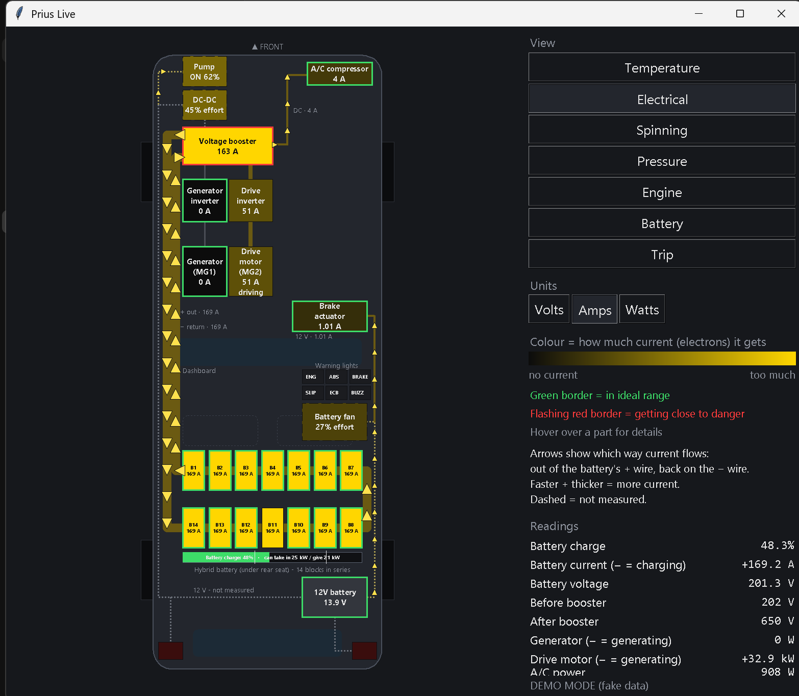
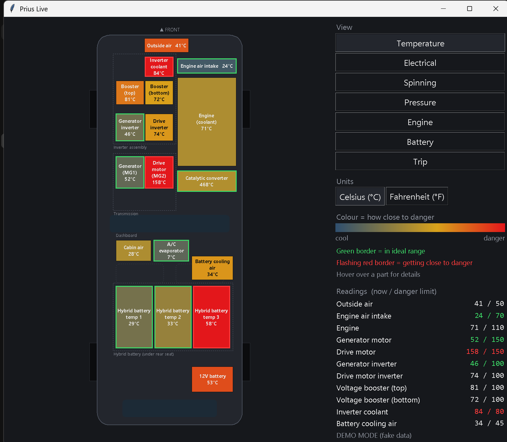
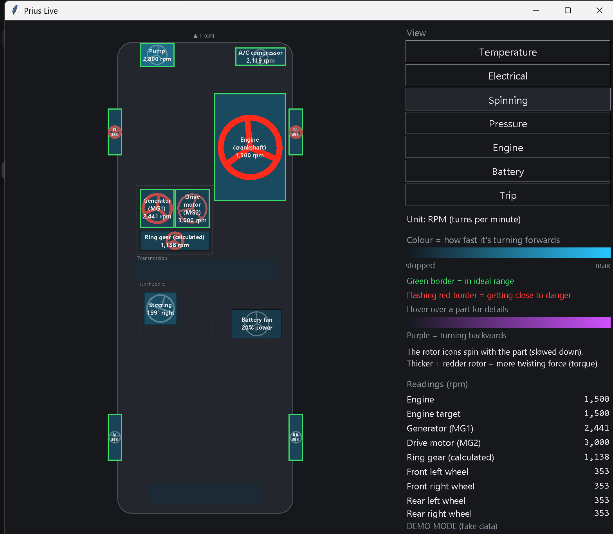
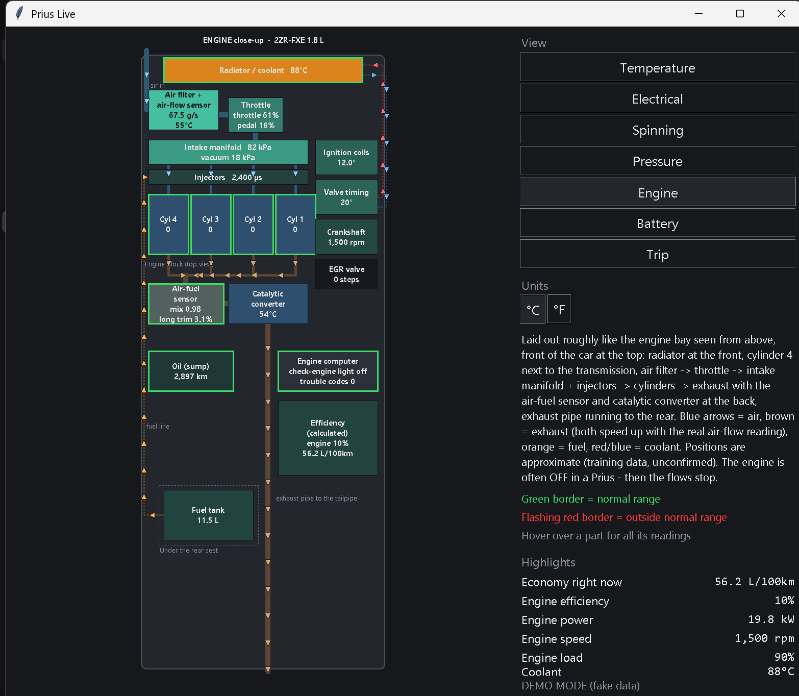
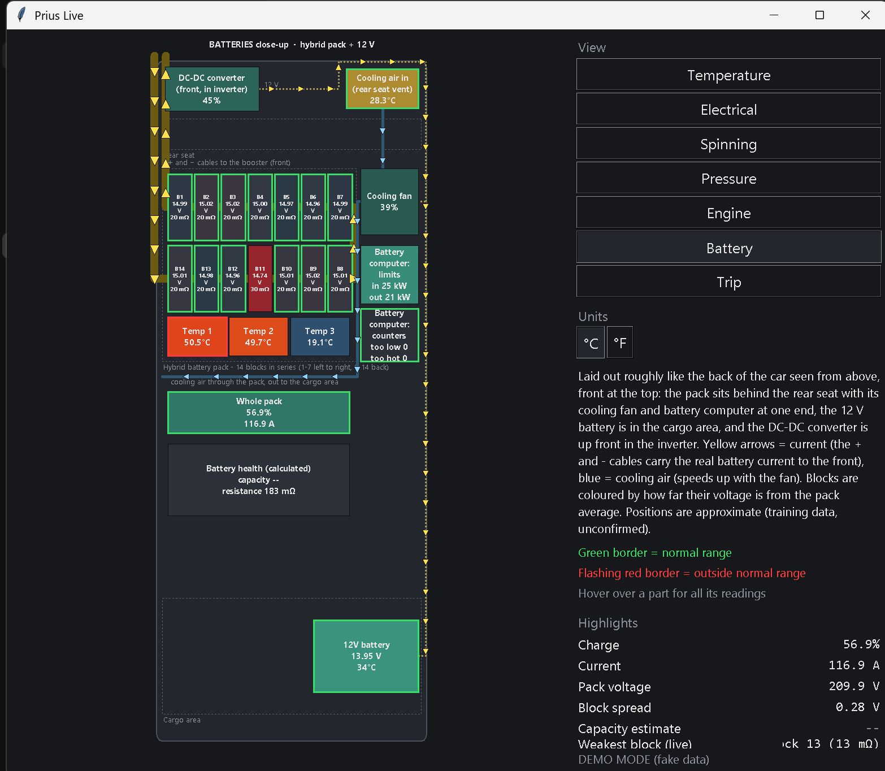
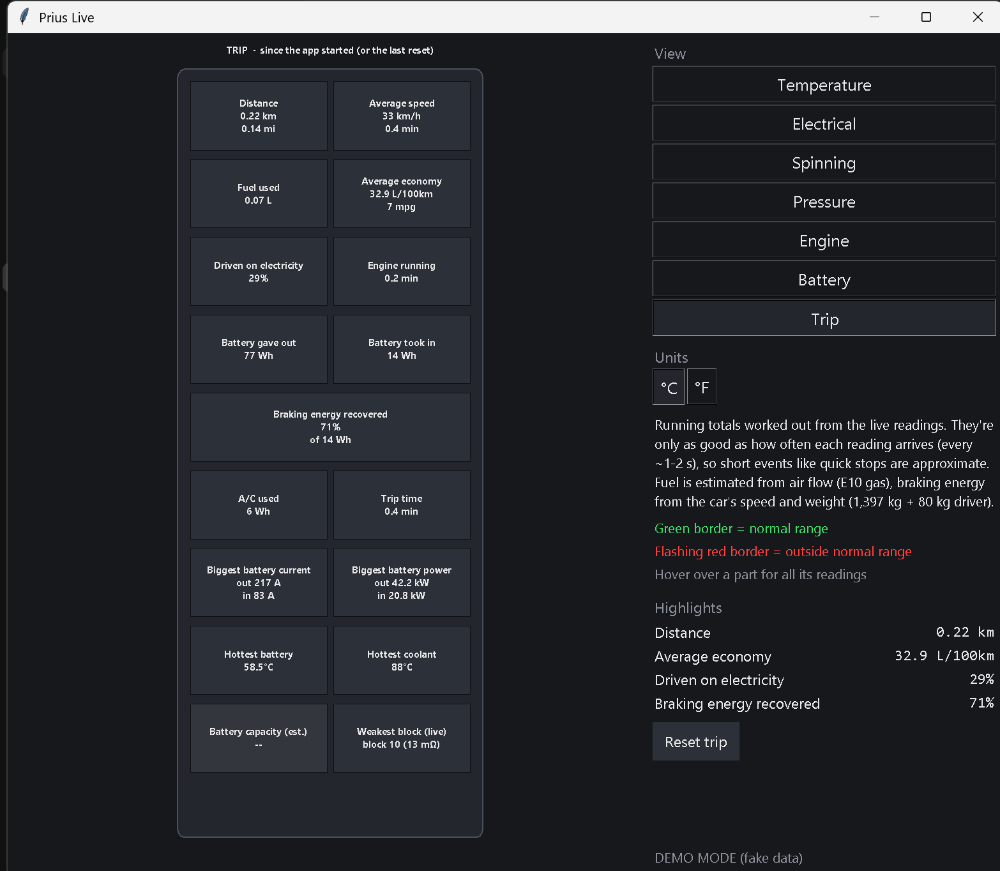

# Prius Live

A live dashboard for the **3rd-generation Toyota Prius (2010-2015, ZVW30)** that runs on a Windows laptop and talks to the
car through a cheap **ELM327 Bluetooth OBD-II adapter**. It shows what the hybrid system is doing in real time: temperatures,
electricity flowing between the battery and motors, everything that spins, pressures, and close-ups of the engine and the
hybrid battery. It also works out fuel economy, engine efficiency, battery health and trip totals.



> Screenshots use the built-in demo mode (made-up numbers).

## Features

| View | What it shows |
|---|---|
| **Temperature** | Top-down car with every part that reports a temperature (motors, inverters, booster, engine, catalytic converter, hybrid battery, cabin, A/C...). Boxes get redder as they get closer to their danger limit. |
| **Electrical** | Battery, booster, inverters, motors, A/C compressor, 12 V system and all 14 battery blocks with animated wires: arrow direction = current direction, speed and thickness = amps. Volts / Amps / Watts. Warning lights, brake lights, battery charge and power limits. |
| **Spinning** | Everything that turns, in RPM: engine, both motor-generators, the planetary ring gear (calculated), all 4 wheels, A/C compressor, coolant pump, battery fan, plus the steering wheel at its real angle. Rotors spin with the part and get thicker/redder with torque. |
| **Pressure** | Intake manifold (and engine vacuum), outside air pressure (and a rough altitude), A/C refrigerant pressure. kPa / psi / bar. |
| **Engine** | Close-up of the engine bay laid out roughly like the real thing: air in -> throttle -> manifold -> cylinders -> exhaust, with animated air, exhaust, fuel and coolant flows. Misfires per cylinder, fuel trims, valve timing, and calculated fuel flow, economy, engine power and efficiency. |
| **Battery** | Close-up of the hybrid pack behind the rear seat: all 14 blocks (voltage, resistance, difference from average), temperatures, cooling air and fan, battery computer limits and stress counters, 12 V battery and DC-DC converter. Live per-block resistance and a capacity estimate. |
| **Trip** | Running totals: distance, fuel used, average economy, share of distance driven on electricity, battery energy in/out, braking energy recovered, A/C energy, maximums. |

Everywhere: green border = normal range, flashing red border = close to danger, hover over any part for every reading,
where it comes from and what it means. All views keep updating in the background, so switching views shows recent data
straight away.

| | | |
|---|---|---|
|  |  |  |
|  |  | |

## What you need

- A **2010-2015 Toyota Prius** (3rd generation). Other Toyota hybrids may partly work, but untested.
- An **ELM327 Bluetooth adapter** (Classic Bluetooth / SPP). Developed with a Veepeak VP11 (reports "ELM327 v1.5").
- **Windows** with **Python 3.10+** (tkinter comes with the normal Python installer).

## Setup

1. Pair the adapter in Windows Bluetooth settings (PIN is usually `1234` or `0000`).
2. Find its COM port: Settings -> Bluetooth & devices -> More Bluetooth settings -> COM Ports. Use the **Outgoing** one.
3. Install the one dependency:
   ```
   python -m pip install -r requirements.txt
   ```
4. Try it without the car (demo mode, fake data):
   ```
   python app.py --demo
   ```
5. In the car, with the car in **READY** and the adapter plugged in:
   ```
   python app.py
   python app.py --port COM5 --view battery
   ```
   Views: `temperature`, `electrical`, `spinning`, `pressure`, `engine`, `battery`, `trip`. Only one program can use the
   adapter at a time.

## How it works

- `elm.py` talks to the ELM327: sets the request header for each computer in the car (`7E2` hybrid, `7E0` engine, `7B0` brakes,
  `7C0` dashboard meter, `7C4` climate), sends a request, and rebuilds multi-frame replies.
- `sensors.py` holds every reading: which computer, which request, and the formula. The current view is polled fast, the
  numbers the trip totals need every few loops, and every other view in the background (~every 8 s).
- `views.py` / `closeups.py` draw the views; `app.py` is the window, hover cards and animation.
- `calc.py` works out the calculated numbers and the trip totals; `specs.py` holds the car and fuel constants **with sources**.

Speed tricks (measured in the car): the app tells the adapter how many reply frames to expect (single-frame requests went
from 64-174 ms to 36-44 ms), learns that count per request and falls back automatically if a reply comes back incomplete,
and switches between computers with a single command.

## Calculated numbers

| Number | Formula |
|---|---|
| Fuel flow | air flow / (14.1 x lambda) for E10 pump gas, / 0.745 kg/L |
| Economy | fuel flow / speed |
| Engine torque | planetary gear balance: -MG1 torque x (30 + 78) / 30 |
| Engine power / efficiency | torque x rpm; power / (fuel flow x 31.2 MJ/L) |
| Braking energy recovered | energy into the battery while braking / ½ x mass x (v1² - v2²) |
| Live block resistance | slope of each block's voltage vs pack current (least squares) |
| Capacity estimate | amp-hours counted / change in the car's charge % |
| Ring gear / wheel RPM | planetary gear + 2.636 motor reduction + 3.267 final drive + stock 195/65R15 tire |

Constants and where they come from are in [`specs.py`](specs.py). Estimates are labelled as estimates in the app.

## Test tools

- `tools/full_sensor_test.ps1`: reads every request in the PID list once, then walks you through things to do with the
  car (brake, A/C, steering, reverse, a short slow drive...) and shows which readings react. Saves a log to your Desktop.
  Paste it into Windows PowerShell 5.1, or run it as a script.
- `tools/analyze_test.py`: decodes that log with every formula in the PID spreadsheet.
- `tools/speed_test.ps1`: times the adapter with different settings and listens for broadcast CAN messages.

## What's confirmed on a real car

Tested on a 2010 Prius (2026-09): all five computers answer; 96 of 98 read requests return data, and every reading the
app uses answered. Things from the PID spreadsheet that **don't** work on this car and are worked around or left out:
the stop-light relay bit (the app uses the stop-light switch instead), the inverter water pump "running" bit (uses pump
RPM instead), "actual engine torque" (always 0 - the app calculates it instead), the oil pressure switch and the evap
(fuel tank vapour) pressure (no usable reply), and the lateral/forward G formula (needs a signed byte).

## Safety and disclaimer

- The app and test scripts only send **read** requests (OBD modes 01 and 21) and adapter settings. The PID spreadsheet
  also contains *write* commands that change car settings; those are never sent.
- Don't look at the laptop while driving. Have a passenger watch it, or use the Trip view afterwards.
- "Normal" and "danger" ranges are the author's estimates unless a source is given; they're not Toyota specifications.
  This isn't a diagnostic tool: if the car shows a warning light, trust the car.
- Not affiliated with or endorsed by Toyota.

## Credits and sources

- PID list: the **GenIII Prius custom PIDs for Torque** thread by *usbseawolf2000* on
  [PriusChat](https://priuschat.com/threads/geniii-prius-custom-pids-for-torque-app.98693/) and the
  "ZVW30 Custom PIDs for Torque" spreadsheet linked there (Vincent1449p). The spreadsheet isn't included here.
- Car data: Toyota [3rd-generation Prius emergency response guide](https://techinfo.toyota.com/techInfoPortal/staticcontent/en/techinfo/html/prelogin/docs/3rdprius.pdf),
  Oak Ridge National Laboratory [evaluation of the 2010 Prius](https://info.ornl.gov/sites/publications/files/Pub26762.pdf),
  [Wikipedia: Toyota Prius (XW30)](https://en.wikipedia.org/wiki/Toyota_Prius_(XW30)); fuel data from the US DOE
  [Alternative Fuels Data Center](https://afdc.energy.gov/fuels/properties). Full list in [`specs.py`](specs.py).

## License

[MIT](LICENSE)
